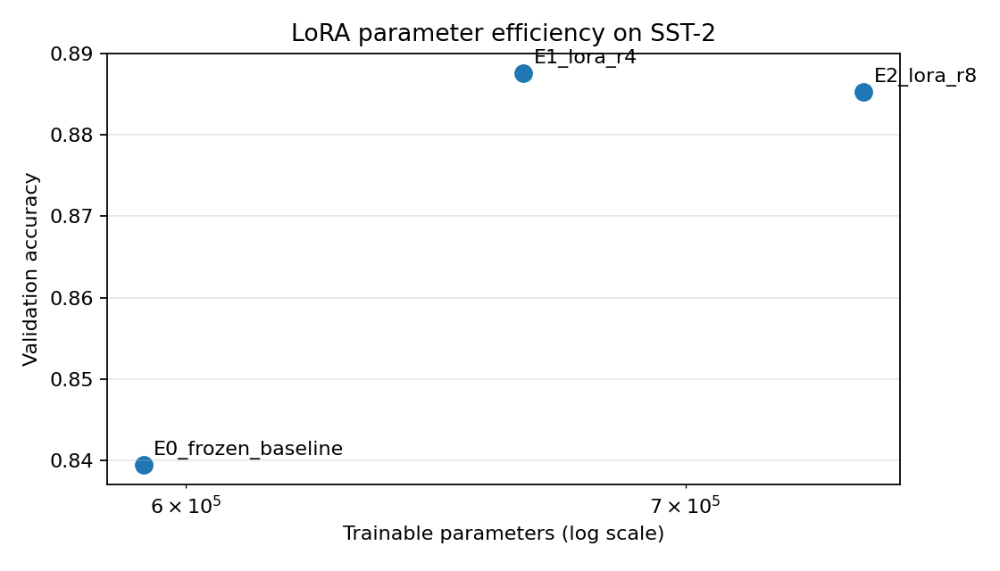
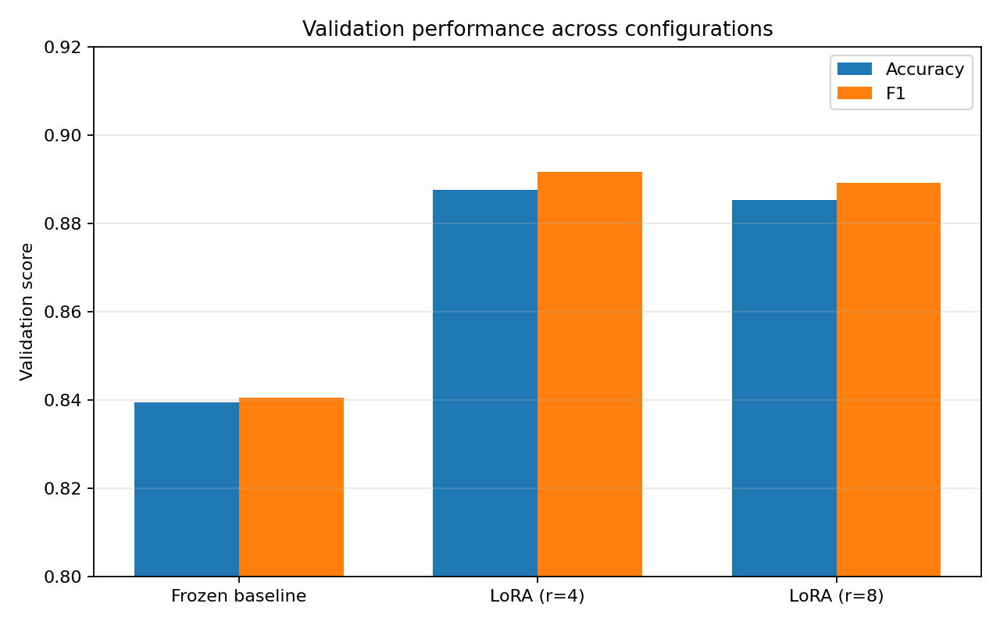

# Reproducing LoRA for Parameter-Efficient Fine-Tuning of Transformer Models

A focused reproduction of the core methodology from:

> Hu et al., "LoRA: Low-Rank Adaptation of Large Language Models"

This project investigates whether Low-Rank Adaptation (LoRA) can adapt a pretrained Transformer to a downstream classification task while updating only a small fraction of the model's parameters.

---

## 1. Research Question

**How effectively can LoRA adapt a pretrained Transformer to a downstream task while updating only a small fraction of the model's parameters?**

A secondary question is:

**How does LoRA rank affect the trade-off between trainable parameters and downstream performance?**

The reproduction focuses on a controlled comparison between a frozen pretrained baseline and two LoRA configurations with different ranks.

---

## 2. Task

The downstream task is binary sentiment classification on the **SST-2** dataset from the GLUE benchmark.

Each example consists of a sentence and a binary sentiment label.

### Model

- Base model: `distilbert-base-uncased`
- Architecture: DistilBERT
- Task: Sequence classification
- Number of labels: 2
- Maximum sequence length: 128

### LoRA configuration

LoRA adapters are applied to the DistilBERT attention projections:

- Target modules: `q_lin`, `v_lin`
- LoRA alpha: `2 × rank`
- LoRA dropout: `0.1`
- Bias: `none`

The implementation uses the Hugging Face PEFT library rather than implementing LoRA from scratch.

---

## 3. Experimental Design

Three configurations were evaluated under the same experimental setup.

| Experiment | Description |
|---|---|
| E0 | Frozen pretrained encoder + trainable classification head |
| E1 | LoRA with rank `r=4` |
| E2 | LoRA with rank `r=8` |

### Controlled variables

The following settings were kept constant across experiments:

- Dataset: SST-2
- Base model: DistilBERT
- Maximum sequence length: 128
- Training batch size: 32
- Evaluation batch size: 64
- Learning rate: `2e-4`
- Epochs: 3
- Weight decay: `0.01`
- Warmup ratio: `0.1`
- Random seed: 42
- Optimizer: AdamW
- Scheduler: linear learning-rate schedule

The primary experimental variable for E1 vs. E2 is the **LoRA rank**.

---

## 4. Why the Baseline Is Frozen

The baseline does not fully fine-tune DistilBERT.

Instead:

- the pretrained DistilBERT encoder is frozen;
- the task-specific classification layers are trainable.

This provides a lightweight baseline against which LoRA adaptation can be compared.

The baseline therefore tests how much performance can be obtained by training only the task-specific head, while LoRA tests whether adding low-rank adaptation to the pretrained attention layers provides a meaningful improvement.

---

## 5. Results

All values below are measured directly from the completed experiments.

| Experiment | Rank | Validation Loss | Accuracy | F1 | Trainable Params | Trainable % | Training Time |
|---|---:|---:|---:|---:|---:|---:|---:|
| Frozen baseline | 0 | 0.3595 | 83.95% | 0.8405 | 592,130 | 0.884% | 125.8s |
| **LoRA** | **4** | **0.2809** | **88.76%** | **0.8916** | 665,858 | 0.985% | 271.5s |
| LoRA | 8 | 0.2966 | 88.53% | 0.8891 | 739,586 | 1.093% | 271.1s |

### Peak GPU memory

| Experiment | Peak GPU Memory |
|---|---:|
| Frozen baseline | 669.7 MB |
| LoRA r=4 | 1083.4 MB |
| LoRA r=8 | 1084.6 MB |

### Key observations

#### 1. LoRA substantially improved downstream performance

The frozen baseline achieved **83.95% validation accuracy**.

LoRA r=4 achieved **88.76%**, an improvement of approximately **4.82 percentage points**.

F1 similarly increased from **0.8405** to **0.8916**.

Validation loss decreased from **0.3595** to **0.2809**.

This demonstrates that low-rank adaptation provided substantially better task adaptation than training only the classification head.

#### 2. LoRA remained highly parameter-efficient

The r=4 configuration trained only **665,858 parameters**, approximately **0.985%** of the model parameters.

The r=8 configuration trained **739,586 parameters**, approximately **1.093%**.

Thus, both LoRA configurations updated only around one percent of the model's parameters.

#### 3. Increasing rank from 4 to 8 did not improve performance

The r=8 configuration had more trainable parameters than r=4:

- r=4: 665,858 trainable parameters
- r=8: 739,586 trainable parameters

However, validation performance slightly decreased:

- Accuracy: 88.76% → 88.53%
- F1: 0.8916 → 0.8891
- Validation loss: 0.2809 → 0.2966

Within the tested configurations, **r=4 was therefore the best-performing LoRA configuration**.

This suggests that the additional adaptation capacity provided by r=8 was not beneficial for this particular SST-2 setup.

#### 4. Parameter efficiency did not mean lower wall-clock training time

The frozen baseline completed training in approximately **126 seconds**, while both LoRA configurations took approximately **271 seconds**.

This illustrates an important distinction:

> Parameter-efficient fine-tuning reduces the number of parameters being updated, but it does not necessarily reduce wall-clock training time.

LoRA introduces trainable adapter computations throughout the selected attention projections, while the frozen baseline trains only the classification head.

---

## 6. Parameter Efficiency

The main motivation for LoRA is to avoid updating the entire pretrained model.

The experiments demonstrate this directly.

The LoRA configurations train roughly **1% of the model parameters**, while still improving validation performance substantially over the frozen-head baseline.

The relationship between trainable parameters and validation accuracy is shown below.



Performance across the three configurations is shown below.



---

## 7. Implementation

The project is organized as a small reusable Python package rather than a notebook-only implementation.

```text
lora-reproduction/
├── .gitignore
├── README.md
├── requirements.txt
├── notebooks/
│   └── lora_reproduction.ipynb
├── results/
│   ├── experiment_results.csv
│   └── figures/
│       ├── accuracy_vs_trainable_parameters.png
│       └── performance_by_configuration.png
└── src/
    ├── __init__.py
    ├── config.py
    ├── data.py
    ├── evaluate.py
    ├── model.py
    ├── train.py
    └── visualize.py

Core modules

src/config.py

Defines the experiment configurations and shared hyperparameters.

src/data.py

Loads and tokenizes SST-2 and creates the training and validation data loaders.

src/model.py

Constructs the frozen baseline or applies PEFT LoRA adapters to the pretrained model.

src/train.py

Contains the reproducible training loop, parameter accounting, timing, GPU memory measurement, and result persistence.

src/evaluate.py

Evaluates validation loss, accuracy, and F1.

src/visualize.py

Generates the result figures directly from the measured CSV.

notebooks/lora_reproduction.ipynb

Contains the project execution workflow and experiment orchestration.


## 8. Reproducibility

The experiments were executed on a Kaggle GPU environment.

### Hardware

- GPU: NVIDIA Tesla P100-PCIE-16GB
- GPU memory: 16 GB

### Reproducibility controls

The implementation explicitly seeds:

- Python
- NumPy
- PyTorch
- CUDA

DataLoader shuffling also uses the configured random seed.

The experiment configurations are defined centrally in `src/config.py`, allowing the experimental settings to be reproduced consistently.

### Running the project

Install the dependencies:

```bash
pip install -r requirements.txt
The main experiment workflow is provided in:

notebooks/lora_reproduction.ipynb

The experiment results are written to:

results/experiment_results.csv

Figures can be generated from completed results using:

src/visualize.py
Execution environment note

The experiments were run in Kaggle because GPU acceleration was required. The repository contains the source code, configuration, notebook workflow, measured results, and generated figures needed to understand and reproduce the experiment.


## 9. Software / Infrastructure Failure Analysis

Several software and infrastructure compatibility issues were encountered before the experiments could run successfully.

### PyTorch / GPU compatibility

The initial Kaggle environment provided a newer CUDA/PyTorch build that was not compatible with the Tesla P100 GPU for the required CUDA kernels.

A compatible PyTorch CUDA build was installed and verified using an actual GPU tensor computation.

### Torchvision compatibility

After changing the PyTorch version, the preinstalled torchvision version was incompatible with the selected PyTorch version.

A matching torchvision version was installed before continuing.

### TorchAO / PEFT compatibility

The installed `torchao` version was incompatible with the PEFT version required for LoRA injection.

`torchao` was upgraded to a compatible version before the PEFT model could be constructed.

### Verification

The environment was not considered ready until:

1. CUDA was available.
2. A GPU tensor computation succeeded.
3. Transformers and PEFT imported successfully.
4. LoRA adapters could be injected into DistilBERT.
5. A small SST-2 smoke test completed forward propagation, loss computation, backpropagation, and an optimizer update.
6. The three full experiments completed and produced measured result rows.

These issues were treated as **software/infrastructure compatibility problems**, rather than model-performance failures.

---

## 10. Limitations

This reproduction is intentionally scoped rather than a full replication of every experiment in the original LoRA paper.

Limitations include:

- Only SST-2 sentiment classification was evaluated.
- Only DistilBERT was used as the pretrained Transformer.
- Only LoRA ranks 4 and 8 were compared.
- The experiment does not include full-model fine-tuning as a comparison.
- Results are based on a single random seed.
- The study does not evaluate multiple downstream datasets.
- The study does not reproduce the larger language-model experiments from the original LoRA paper.

Therefore, the conclusions should be interpreted as observations from this controlled SST-2 experiment rather than universal claims about LoRA.

---

## 11. Conclusion

This reproduction provides a controlled demonstration of parameter-efficient fine-tuning with LoRA.

The experiments show that:

1. LoRA substantially improved SST-2 validation performance over a frozen pretrained encoder with a trainable classification head.
2. The improvement was achieved while training approximately **1% of the model parameters**.
3. Among the tested configurations, **LoRA r=4 performed best**.
4. Increasing the LoRA rank from 4 to 8 increased trainable parameters but did not improve validation performance.
5. Parameter-efficient fine-tuning did not translate directly into lower wall-clock training time in this implementation.

Overall, the results support the central motivation behind LoRA: use a small number of trainable low-rank parameters to adapt a pretrained model effectively without updating the entire model.

---

## 12. Reference

Hu, E. J., Shen, Y., Wallis, P., Allen-Zhu, Z., Li, Y., Wang, S., Wang, L., & Chen, W.

**LoRA: Low-Rank Adaptation of Large Language Models.**

International Conference on Learning Representations (ICLR), 2022.

https://arxiv.org/abs/2106.09685

---

## 7. Implementation

The project is organized as a small reusable Python package rather than a notebook-only implementation.

```text
lora-reproduction/
├── .gitignore
├── README.md
├── requirements.txt
├── notebooks/
│   └── lora_reproduction.ipynb
├── results/
│   ├── experiment_results.csv
│   └── figures/
│       ├── accuracy_vs_trainable_parameters.png
│       └── performance_by_configuration.png
└── src/
    ├── __init__.py
    ├── config.py
    ├── data.py
    ├── evaluate.py
    ├── model.py
    ├── train.py
    └── visualize.py

### Core modules

**`src/config.py`**

Defines the experiment configurations and shared hyperparameters.

**`src/data.py`**

Loads and tokenizes SST-2 and creates the training and validation data loaders.

**`src/model.py`**

Constructs the frozen baseline or applies PEFT LoRA adapters to the pretrained model.

**`src/train.py`**

Contains the reproducible training loop, parameter accounting, timing, GPU memory measurement, and result persistence.

**`src/evaluate.py`**

Evaluates validation loss, accuracy, and F1.

**`src/visualize.py`**

Generates the result figures directly from the measured CSV.

**`notebooks/lora_reproduction.ipynb`**

Contains the project execution workflow and experiment orchestration.

## 8. Reproducibility

The experiments were executed on a Kaggle GPU environment.

### Hardware

- GPU: NVIDIA Tesla P100-PCIE-16GB
- GPU memory: 16 GB

### Reproducibility controls

The implementation explicitly seeds:

- Python
- NumPy
- PyTorch
- CUDA

DataLoader shuffling also uses the configured random seed.

The experiment configurations are defined centrally in `src/config.py`, allowing the experimental settings to be reproduced consistently.

### Running the project

Install the dependencies:

```bash
pip install -r requirements.txt
```
The main experiment workflow is provided in:

notebooks/lora_reproduction.ipynb

The experiment results are written to:

results/experiment_results.csv

Figures can be generated from completed results using:

src/visualize.py
Execution environment note

The experiments were run in Kaggle because GPU acceleration was required. > The repository contains the source code, configuration, notebook workflow, measured results, and generated figures used to reproduce and document the experiment.


## 11. Conclusion

This reproduction provides a controlled demonstration of parameter-efficient fine-tuning with LoRA.

The experiments show that:

1. LoRA substantially improved SST-2 validation performance over a frozen pretrained encoder with a trainable classification head.
2. The improvement was achieved while training approximately **1% of the model parameters**.
3. Among the tested configurations, **LoRA r=4 performed best**.
4. Increasing the LoRA rank from 4 to 8 increased trainable parameters but did not improve validation performance.
5. Parameter-efficient fine-tuning did not translate directly into lower wall-clock training time in this implementation.

Overall, these results are consistent with the central motivation behind LoRA: using a small number of trainable low-rank parameters can provide effective downstream adaptation without updating the entire pretrained model.

## 12. Reference

Hu, E. J., Shen, Y., Wallis, P., Allen-Zhu, Z., Li, Y., Wang, S., Wang, L., & Chen, W.

**LoRA: Low-Rank Adaptation of Large Language Models.**

International Conference on Learning Representations (ICLR), 2022.

https://arxiv.org/abs/2106.09685

## 8. Reproducibility

The experiments were executed on a Kaggle GPU environment.

### Hardware

- GPU: NVIDIA Tesla P100-PCIE-16GB
- GPU memory: 16 GB

### Reproducibility controls

The implementation explicitly seeds:

- Python
- NumPy
- PyTorch
- CUDA

DataLoader shuffling also uses the configured random seed.

The experiment configurations are defined centrally in `src/config.py`, allowing the experimental settings to be reproduced consistently.

### Running the project

Install the dependencies:

```bash
pip install -r requirements.txt
```
The main experiment workflow is provided in:

notebooks/lora_reproduction.ipynb

The experiment results are written to:

results/experiment_results.csv

Figures can be generated from completed results using:

src/visualize.py
Execution environment note

The reported experiments were executed with the following package versions:

- PyTorch: 2.14.0+cu126
- Torchvision: 0.29.0+cu126
- Transformers: 5.0.0
- Datasets: 5.0.0
- PEFT: 0.19.1
- Evaluate: 0.4.6
- Scikit-learn: 1.6.1
- Accelerate: 1.13.0
- Matplotlib: 3.10.0
- TorchAO: 0.18.0

The PyTorch and Torchvision builds were configured for the Kaggle CUDA environment used during the experiments.

The experiments were run in Kaggle because GPU acceleration was required. > The repository contains the source code, configuration, notebook workflow, measured results, and generated figures used to reproduce and document the experiment.

